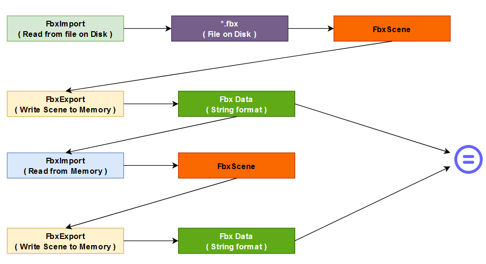

### FbxStream

An example on how to use [FbxStream](https://help.autodesk.com/view/FBX/2016/ENU/?guid=__cpp_ref_class_fbx_stream_html) to read/write data from a memory source.

e.g read/write roundtrip



### How to use 

run FbxStream executable followed by the absolute path to your fbx file.

e.g
```
cd <install_directory>

./FbxStream <abs_path_to_project>/sampleData/simpleAnim.fbx 
FbxStream read/write passed successfully!
FBX Sdk destroyed successfully!
```

### How to build

+ [Build Docs](BUILD.md)

